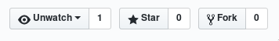
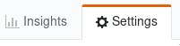
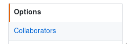
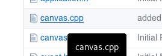
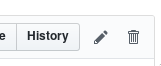
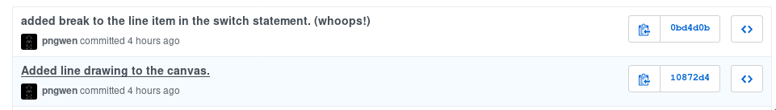

## Introduction

Good news!  You're doing great!  (ok, I can't really know that,
because no due dates have come around and therefore I have graded
nothing, but I think we can generally assume that if you are reading
these words you have at least not given up yet, and that has to count
for something!)

In this week's lab we will be extending the shapes program we started
in class.  Even better, you will be working in small groups, and in
the end the entire thing will be incorporated into one much larger
program.  So this is your first real experience of working on a large
programming team (we're almost 30 strong!)

In order to pull off this feat, we are going to make heavy use of git.
You will learn about forking a github repository, adding
collaborators, sharing a repository, using github history to
understand how a codebase works, and issuing a pull request to push
changes back to the master program.  You'll be doing this all while
trying to grapple with the complexities of an object oriented program
which makes heavy use of inheritance and polymorphism.

Still with me?  Good!  Let's dive in!

## Forming Groups and Performing Your Task
The first step is to form groups.  I will take care of that for you.
Basically whoever is sitting at your table is a group.  I will come
around and give you a shape.  Your job for the lab is to add this
shape to the program.  Just one shape, though altogether the class
is going to add several shapes to the shape program.

## Forking a Repository
The first order of business is for you to fork my program.  This is
not at all difficult, and so it is a good first thing to do with the
group.  The basic idea behind a fork on github is that it makes a new
copy of a repository.  That way you can make changes to, and work
with, other people's code.  In the case of open source programs, this
is a first step to becoming a contributor to the project.  Think of
our shape program as a random program you have found on github.  You
like the program, but you wish it had more shapes.  You're going to
add those shapes to the program, and then you'll be so proud of your
additions that you want to share them with the original author of the
code.  Thus everyone will wind up with a much better program, everyone
wins, and we all live in peace and harmony!  (see http://www.fsf.org)

So how do we go about carrying out this momentous and socially
responsible bit of coding?  Simple!

1. Pick someone in your group to perform the fork.  You'll only be
creating one fork per group.
2. This person needs to log in to their github account, browse to this
repository, and then click the fork button in the upper right hand
corner. 
3. From here it should be a fairly simple matter for you to work out
how to finish the fork.

## Adding Collaborators
At this point, one of your group members now has a forked copy of my
code.  Great!  But you all need to be able to access the repository.
You all can, in fact the whole world can, but only in a read only
way.  To get your friends on board with helping you write the code,
you need to add them as collaborators. Luckily, that too is very easy.

1. Open your forked copy of the repository in your github account.
2. Click on the "settings" tab. 
3. Click on "collaborators" on the left hand side of the screen

4. Add your friends by github username.
5. Your friends will all be invited via email to join the repository.
6. Everyone should now clone a copy of the newly created repository
using the ssh URL.  (remember the "git clone" shell command from
lab1?)
7. Compile and run the shapes program using "make".  Notice that you
can use "p" to add points and "l" to add lines. 

## Exploring the Revision History
Everyone should be able to see the repository both on their terminal
and on their github account.  You're going to be adding shapes to this
program, and in order to show you how to do this I have added another
shape to the program.  I have added the "line" shape.  This involved
creating line.h and line.cpp (of course), but I also had to make a
small revision to canvas.cpp to make that happen. To see my revisions,
first click on canvas.cpp on the repository.

You should now see a nicely colorized version of canvas.cpp.  At the
top of the code, there are a bank of buttons.  Click on "history".

This will, in turn, list all the revisions for canvas.cpp along with a
log entry for each revision.

There are actually two revisions that are important here, because when
I did the first one I introduced a bug into the program.  (I left the
break off of a case in a switch case!)  Go ahead and click on the one
that mentions adding a line.  You'll be greeted with a colorized file
indicating the changes made in the file.  Code that was added in this
revision is highlighted in green.

Code that was removed is highlighted in red.  Go ahead and take a look
at this, and make sure your group understands how to add new shapes to
canvas.cpp before moving on.

Also, have a look at the revision history for the Makefile.  I had to
make some changes here too!  You'll need to do that when you add your
shape.

## Coding Your Shape
How you divide the work up is up to you.  You may all crowd around one
computer, or you may individually share files.  However, try committing
each revision to a file.  Add and commit files as soon as you create
them.  After you make a commit, do a "git push" to push it to your
repository.  If a teammate makes a push, everyone else should do a
"git pull" to update it locally.  Play around with this a bit, and
generate some git activity!

You may want to take a look at my line code to get some ideas of how
to draw shapes.  If you are drawing a shape that uses lines, perhaps
you can use instances of my line object to draw them!  (Now that's
OOP!)  If, however, you wound up with a circle it won't be much help.

## Creating a Pull Request
After you have your shape working, and all of the commits from your
group have been pushed to github, you will need to issue a pull
request.  In fact, this is how you are going to turn in your lab!

Take a look at github's tutorial on creating pull requests:
https://help.github.com/articles/creating-a-pull-request/  Our
repositories are pretty simple for now, they only have the master
branch, so you won't have to change the branch for now.  Once you have
worked out how to send me all your revisions, issue the pull request.
I will pull them all in and merge them in class on Tuesday.

Once all the pull requests are merged into my repository, you can
follow the directions here to update your copy of the repository.
https://help.github.com/articles/syncing-a-fork/

So now you have forked a project, shared a repository, and you have
issued a pull request to an upstream repository.  Once everyone is
done, you will then have synced form an upstream.  You're now equipped
to go out and started participating in open source projects.  Search
github, find code to play with, and enjoy!

## Using Your Group for Conway's Game of Life
If you have time left at the end of the lab, I recommend that you talk
over your designs for program 1 with your group members.  Don't share
code with them, but do share ideas.  I think you'll find that together
you can work through most any programming problem!

In fact, just saying your problems outloud can work wonders!
https://rubberduckdebugging.com/